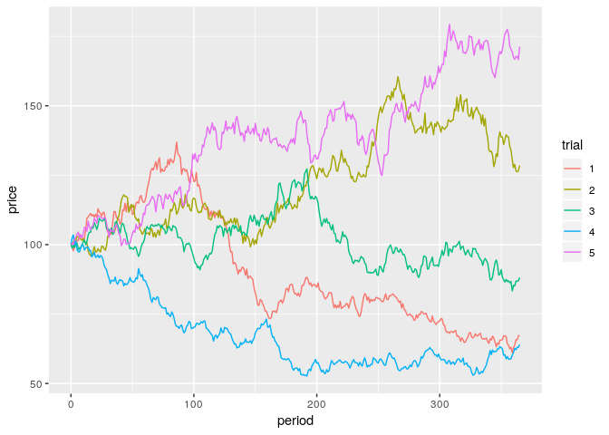
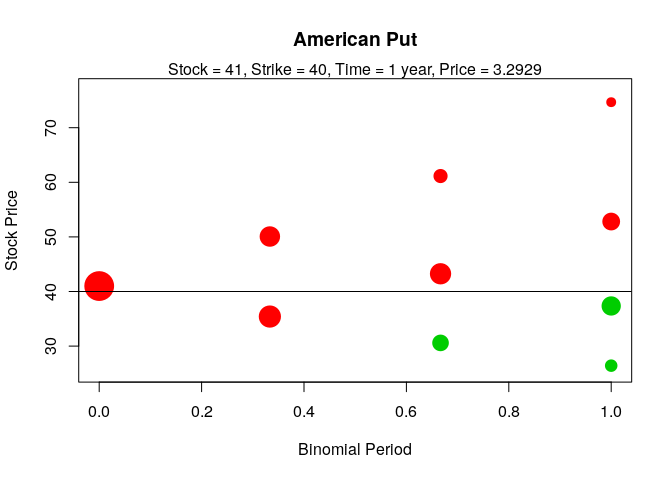
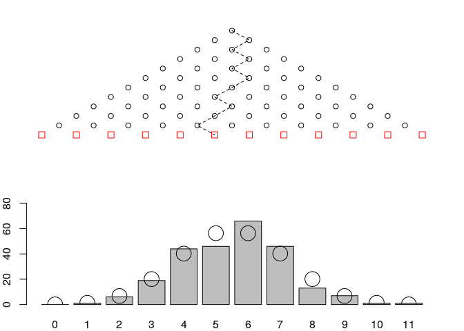

[](https://travis-ci.org/rmcd1024/derivmkts)[](http://www.r-pkg.org/pkg/derivmkts)

This is a collection of option pricing functions for a course in
financial derivatives. The names of the functions mostly match those in
my book *Derivatives Markets*, which explains the package name. This
should be useful for students comfortable with R. In any case, I hope it
will be helpful for instructors.

There are of course other option pricing packages in R, notably
[RQuantLib](https://cran.r-project.org/package=RQuantLib) and
[fOptions](https://cran.r-project.org/package=RQuantLib). I don’t add
significant pricing functionality to those. This package does, however,
have a few aspects that might be unique, which I describe below:
calculation of greeks; display of binomial formula output and trees; and
a quincunx function.

The package includes functions for computing

  - Black-Scholes prices and greeks for European options

  - Option pricing and plotting using the binomial model

  - Barrier options

  - Compound options

  - Pricing of options with jumps using the Merton model

  - Analytical and Monte Carlo pricing of Asian options

## Calculation of Greeks

The function `greeks()` accepts an option pricing function call as an
argument, and returns a vectorized set of greeks for any pricing
function that uses standard input names (i.e., the asset price is `s`,
the volatility is `v`, etc.).

As an example, the following calculation will produce the full
complement of greeks for a call, for each of three strike prices. You
can access the delta values, for example, using `x['Delta', ]`.

``` r
x1 <- greeks(bscall(s=40, k=c(35, 40, 45), v=0.3, r=0.08, tt=0.25, d=0))
x1
             bscall_35   bscall_40   bscall_45
Premium     6.13481997  2.78473666  0.97436823
Delta       0.86401619  0.58251565  0.28200793
Gamma       0.03636698  0.06506303  0.05629794
Vega        0.04364029  0.07807559  0.06755753
Rho         0.07106457  0.05128972  0.02576487
Theta      -0.01340407 -0.01733098 -0.01336419
Psi        -0.08640162 -0.05825156 -0.02820079
Elasticity  5.63352271  8.36726367 11.57705764
```

There is a new `tidy` option which produces output in a more convenient
format (note that `tidy` here refers to the function’s output;
`tidyverse` packages are not required). If `tidy=TRUE`, `long=TRUE` will
produce long-form output.

``` r
x2 <- greeks(bscall(s=40, k=c(35, 40, 45), v=0.3, r=0.08, tt=0.25, d=0),
             tidy=TRUE)
x2
   s  k   v    r   tt d funcname   premium     delta       vega        rho
1 40 35 0.3 0.08 0.25 0   bscall 6.1348200 0.8640162 0.04364029 0.07106457
2 40 40 0.3 0.08 0.25 0   bscall 2.7847367 0.5825156 0.07807559 0.05128972
3 40 45 0.3 0.08 0.25 0   bscall 0.9743682 0.2820079 0.06755753 0.02576487
        theta         psi     elast      gamma
1 -0.01340407 -0.08640162  5.633523 0.03636698
2 -0.01733098 -0.05825156  8.367264 0.06506303
3 -0.01336419 -0.02820079 11.577058 0.05629794
x3 <- greeks(bscall(s=40, k=c(35, 40, 45), v=0.3, r=0.08, tt=0.25, d=0),
             tidy=TRUE, long=TRUE)
x3
    s  k   v    r   tt d funcname   greek       value
1  40 35 0.3 0.08 0.25 0   bscall premium  6.13481997
2  40 40 0.3 0.08 0.25 0   bscall premium  2.78473666
3  40 45 0.3 0.08 0.25 0   bscall premium  0.97436823
4  40 35 0.3 0.08 0.25 0   bscall   delta  0.86401619
5  40 40 0.3 0.08 0.25 0   bscall   delta  0.58251565
6  40 45 0.3 0.08 0.25 0   bscall   delta  0.28200793
7  40 35 0.3 0.08 0.25 0   bscall    vega  0.04364029
8  40 40 0.3 0.08 0.25 0   bscall    vega  0.07807559
9  40 45 0.3 0.08 0.25 0   bscall    vega  0.06755753
10 40 35 0.3 0.08 0.25 0   bscall     rho  0.07106457
11 40 40 0.3 0.08 0.25 0   bscall     rho  0.05128972
12 40 45 0.3 0.08 0.25 0   bscall     rho  0.02576487
13 40 35 0.3 0.08 0.25 0   bscall   theta -0.01340407
14 40 40 0.3 0.08 0.25 0   bscall   theta -0.01733098
15 40 45 0.3 0.08 0.25 0   bscall   theta -0.01336419
16 40 35 0.3 0.08 0.25 0   bscall     psi -0.08640162
17 40 40 0.3 0.08 0.25 0   bscall     psi -0.05825156
18 40 45 0.3 0.08 0.25 0   bscall     psi -0.02820079
19 40 35 0.3 0.08 0.25 0   bscall   elast  5.63352271
20 40 40 0.3 0.08 0.25 0   bscall   elast  8.36726367
21 40 45 0.3 0.08 0.25 0   bscall   elast 11.57705764
22 40 35 0.3 0.08 0.25 0   bscall   gamma  0.03636698
23 40 40 0.3 0.08 0.25 0   bscall   gamma  0.06506303
24 40 45 0.3 0.08 0.25 0   bscall   gamma  0.05629794
```

The following computes and plots all call and put Greeks for 500
options, 16 plots in all:

``` r
k <- 100; r <- 0.08; v <- 0.30; tt <- 2; d <- 0
S <- seq(.5, 250, by=.5)
y <- list(Call=greeks(bscall(S, k, v, r, tt, d)),
          Put=greeks(bsput(S, k, v, r, tt, d))
          )
par(mfrow=c(4, 4))  ## create a 4x4 plot
par(mar=c(2,2,2,2)) ## shrink some of the margins
for (i in names(y)) {
    for (j in rownames(y[[i]])) {  ## loop over greeks
        plot(S, y[[i]][j, ], main=paste(i, j), ylab=j, type='l')
    }
}
```

<!-- -->

And here is a version of the plot using `ggplot`:

``` r
library(derivmkts)
library(ggplot2)
k <- 100; r <- 0.08; v <- 0.30; tt <- 2; d <- 0
S <- seq(.5, 250, by=.5)
yc <- greeks(bscall(S, k, v, r, tt, d), tidy=TRUE, long=TRUE)
yp <- greeks(bsput(S, k, v, r, tt, d), tidy=TRUE, long=TRUE)
ggplot(rbind(yc, yp), aes(x=s, y=value, color=funcname)) + geom_line() +
    facet_wrap(~ greek, scales='free_y')
```

<!-- -->

## Binomial calculations

### binomopt

By default the binomopt function returns the price of an American call.
In adddition:

  - `putopt=TRUE` returns the price of an American put.

  - `returngreeks=TRUE` returns a subset of the Greeks along with the
    binomial parameters.

  - `returntrees=TRUE` returns as a list all of the above plus the full
    binomial tree ($stree), the probability of reaching each node
    ($probtree), whether or not the option is exercised at each node
    ($exertree), and the replicating portfolio at each node ($deltatree
    and $bondtree).

Here is an example illustrating everything that the `binomopt` function
can return:

``` r
x <- binomopt(41, 40, .3, .08, 1, 0, 3, putopt=TRUE, american=TRUE,
              returntrees=TRUE)
x
$price
   price 
3.292948 

$greeks
       delta        gamma        theta 
-0.331656818  0.037840906 -0.005106465 

$params
         s          k          v          r         tt          d 
41.0000000 40.0000000  0.3000000  0.0800000  1.0000000  0.0000000 
     nstep          p         up         dn          h 
 3.0000000  0.4568067  1.2212461  0.8636926  0.3333333 

$oppricetree
         [,1]      [,2]     [,3]      [,4]
[1,] 3.292948 0.7409412 0.000000  0.000000
[2,] 0.000000 5.6029294 1.400911  0.000000
[3,] 0.000000 0.0000000 9.415442  2.648727
[4,] 0.000000 0.0000000 0.000000 13.584345

$stree
     [,1]     [,2]     [,3]     [,4]
[1,]   41 50.07109 61.14913 74.67813
[2,]    0 35.41139 43.24603 52.81404
[3,]    0  0.00000 30.58456 37.35127
[4,]    0  0.00000  0.00000 26.41565

$probtree
     [,1]      [,2]      [,3]       [,4]
[1,]    1 0.4568067 0.2086723 0.09532291
[2,]    0 0.5431933 0.4962687 0.34004825
[3,]    0 0.0000000 0.2950590 0.40435476
[4,]    0 0.0000000 0.0000000 0.16027409

$exertree
      [,1]  [,2]  [,3]  [,4]
[1,] FALSE FALSE FALSE FALSE
[2,] FALSE FALSE FALSE FALSE
[3,] FALSE FALSE  TRUE  TRUE
[4,] FALSE FALSE FALSE  TRUE

$deltatree
           [,1]        [,2]       [,3]
[1,] -0.3316568 -0.07824964  0.0000000
[2,]  0.0000000 -0.63298582 -0.1712971
[3,]  0.0000000  0.00000000 -1.0000000

$bondtree
         [,1]      [,2]      [,3]
[1,] 16.89088  4.658986  0.000000
[2,]  0.00000 28.017840  8.808828
[3,]  0.00000  0.000000 38.947430
```

### binomplot

This function plots the binomial tree, providing a visual depiction of
the nodes, the probability of reaching each node, and whether exercise
occurs at that node.

``` r
binomplot(41, 40, .3, .08, 1, 0, 3, putopt=TRUE, american=TRUE)
```

<!-- -->

## Galton board or quincunx

The [Galton board](http://mathworld.wolfram.com/GaltonBoard.html) is a
pegboard that illustrates the central limit theorem. Balls drop from the
top and randomly fall right or left, providing a physical simulation of
a binomial distribution. (My physicist brother-in-law tells me that
real-life Galton boards don’t typically generate a normal distribution
because, among other things, balls acquire momentum in the direction of
their original travel. The distribution is thus likely to be
fatter-tailed than normal.)

You can see the Galton board in action with `quincunx()`:

``` r
quincunx(n=11, numballs=250, delay=0, probright=0.5)
```

<!-- -->

## Feedback

Please feel free to contact me with bug reports or suggestions. Best
would be to file an issue on Github, but email is fine as well.

I hope you find this helpful\!
